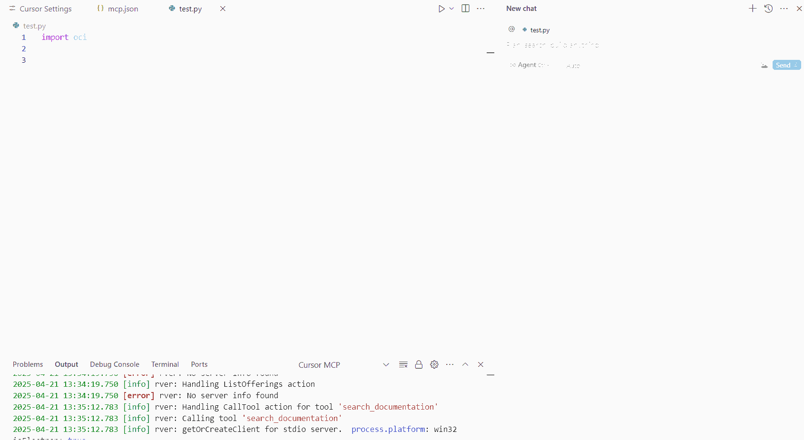

*Inspired by: https://github.com/awslabs/mcp/tree/main/src/aws-documentation-mcp-server*

# OCI Documentation MCP Server

Model Context Protocol (MCP) server for OCI Documentation

This MCP server provides tools to search for content, and access OCI documentation.

## Features

- **Read Documentation**: Fetch and convert OCI documentation pages to markdown format
- **Search Documentation**: Search OCI documentation using search engine

## Prerequisites

### Installation Requirements

1. Install `uv` from [Astral](https://docs.astral.sh/uv/getting-started/installation/) or the [GitHub README](https://github.com/astral-sh/uv#installation)
2. Install Python 3.10 or newer using `uv python install 3.10` (or a more recent version)

## Installation

MCP config:

```json
{
  "mcpServers": {
      "oci-documentation-mcp-server": {
        "command": "uvx",
        "args": [
          "--from",
          "oci-documentation-mcp-server@latest",
          "python",
          "-m",
          "oci_documentation_mcp_server.server"
        ],
        "env": {
          "FASTMCP_LOG_LEVEL": "ERROR"
        },
        "disabled": false,
        "autoApprove": []
    },
  }
}

```


If above doesn't work, try below one:

```json
{
  "mcpServers": {
    "oci-documentation-mcp-server": {
        "command": "uvx",
        "args": ["oci-documentation-mcp-server@latest"],
        "env": {
          "FASTMCP_LOG_LEVEL": "ERROR"
        },
        "disabled": false,
        "autoApprove": []
    }
  }
}
```

## Basic Usage
Example:
 - In Cursor ask: `Write a function to download files for OCI Object Storage.`

 
 


## Tools

### read_documentation

Fetches an OCI documentation page and converts it to markdown format.

```python
read_documentation(url: str) -> str
```

### search_documentation

Searches OCI documentation using the search engine.

```python
search_documentation(search_phrase: str, limit: int) -> list[dict]
```
